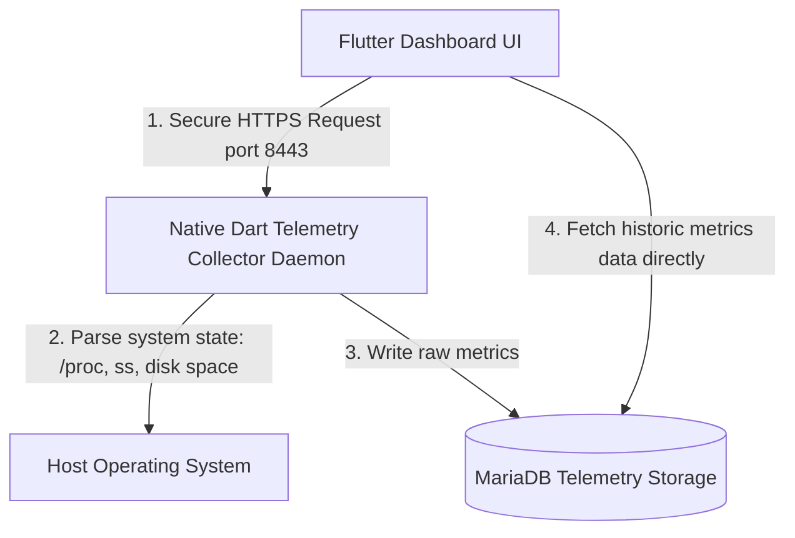
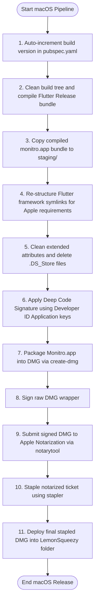
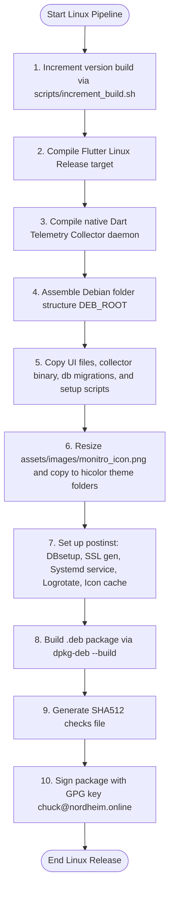

# Monitro — Workstation Observability & Pipeline Manual

Welcome to **Monitro**! Monitro is an advanced, high-performance system observability and monitoring platform designed to provide deep telemetry insights into Linux and macOS workstations.

---

## 🚀 1. Architecture & Security Model

Monitro is designed with a decoupled, dual-layer architecture:
*   **The Backend Collector:** A headless native daemon that gathers system metrics (CPU, RAM, Disks, processes, and active socket lists).
*   **The Storage Layer:** Stores raw telemetry metrics in a local **MariaDB** database.
*   **The UI Dashboard:** A rich, responsive desktop interface built with Flutter that communicates with the local collector daemon.
*   **Transport Security:** Telemetry communication is encrypted locally over HTTPS using dynamically generated **4096-bit local RSA SSL certificates**.

---

## ⚙️ 2. Technical Stack & Dependencies

Monitro uses modern, optimized libraries across its stack:

| Component | Technology / Library | Description |
| :--- | :--- | :--- |
| **User Interface** | Flutter SDK & GoRouter | Power the responsive GTK-styled desktop dashboard. |
| **State Broker** | `flutter_riverpod` | Manages telemetry data states and user configurations. |
| **Data Graphs** | `fl_chart` | Visualises real-time CPU spikes, memory loads, and disk throughputs. |
| **Config Parser** | `yaml` | Parses configuration fields inside `monitro.yaml`. |
| **Local Cache** | `shared_preferences` | Caches user preferences and dashboard settings locally. |
| **Telemetry DB** | MariaDB 10.6+ | Stores historical system metric queries securely. |

---

## 📥 3. Deployment & Setup Guides

### Linux Installation (Debian/Ubuntu)
1.  **Install Database Server:**
    ```bash
    sudo apt update
    sudo apt install mariadb-server
    sudo systemctl enable --now mariadb
    ```
2.  **Initialize Database Schema:**
    Run migrations against MariaDB to create target tables:
    ```bash
    sudo mysql -u root < db/migrations/001_initial_schema.sql
    ```
3.  **Install Monitro Debian Package:**
    ```bash
    sudo dpkg -i monitro_*.deb
    ```
    > [!NOTE]
    > The installation script registers a `postinst` trigger that copies `monitro.example.yaml` to `/opt/monitro/config/monitro.yaml`, runs database setups, generates custom 4096-bit local SSL keys via `gen_certs.sh`, trusts the generated CA certificate, registers `monitro-collector.service` in systemd, and configures `/etc/logrotate.d/monitro-collector` triggers.
4.  **Configure & Launch:**
    Customize parameters inside `/opt/monitro/config/monitro.yaml`. Ensure that a valid `api_key` is set, as the local API will refuse to start without it for security purposes. Once configured, search for **Monitro** in your desktop application grid.

### macOS Installation
1.  **Install Telemetry DB:**
    ```bash
    brew install mariadb
    brew services start mariadb
    ```
2.  **Drag-and-Drop Installation:**
    Download `monitro_*_macos.dmg`, open it, and drag the **Monitro** icon to `/Applications`.
3.  **Launch:**
    The application dynamically inherits macOS sandboxing network entitlements to allow unhindered secure local socket communications with the telemetry agent.

---

## 🔄 4. System Telemetry Architecture



---

## 🪵 5. Troubleshooting & Diagnostics

Capture logs if the dashboard cannot establish communication with the backend collector:

*   **In-App Alerts:** Open the **Alerts** tab inside the dashboard UI to view system warnings and threshold breaches.
*   **Redirecting Collector Output:** Capturing collector stdout is critical for diagnosing SSL permission or SQL connection errors:
    ```bash
    /opt/monitro/backend/monitro_collector --config /opt/monitro/config/monitro.yaml > ~/monitro_debug.log 2>&1 &
    ```
*   **Errno 98 (Address in Use):** A collector instance is already listening on port 8443. Execute `killall -9 monitro_collector` to clear it.
*   **Errno 13 (Permission Denied):** The daemon cannot read `server.key`. Fix certificate ownership:
    ```bash
    sudo chown -R $USER:$USER /opt/monitro/certs/
    ```

---

## 🏗️ 6. Automated Packaging & Release Pipelines

Monitro utilizes platform-specific automation to build, sign, and notarize installers:

### A. macOS Release Pipeline (`build_macos.sh`)



#### macOS Pipeline Details
*   **Framework Tree Alignment:** Fixes compiled Flutter framework trees by creating `Versions/A/` structures, moving binary resources, and creating required symlinks to prevent code-signing failures.
*   **Developer ID Signing:** Signs the bundle using `Developer ID Application: Charles Talk (89B5GL8WMK)` with hardened runtime options and entitlements.
*   **Apple Notarization:** Validates the signature against Apple Notary servers using `xcrun notarytool` and attaches the notarized receipt directly via `xcrun stapler staple`.
*   **LemonSqueezy Copying:** Automatically copies the completed DMG directly to `/Users/charlestalk/AntiGravity/LemonSqueezy/monitro<Date><Version>/` for production delivery.

---

### B. Linux Release Pipeline (`package_linux.sh`)



#### Linux Pipeline Details
*   **Dart Compilation:** Compiles `monitro_collector.dart` into a headless native executable using `dart compile exe`.
*   **AppGrid Visibility:** Resizes application icons into standard sizes (48x48, 64x64, 128x128, 256x256, 512x512) and registers them inside `usr/share/icons/hicolor/` to make Monitro discoverable in desktop launchers.
*   **Post-Install System Integration:** Sets default configs, initializes MariaDB tables, sets up 4096-bit local SSL keys, registers the collector daemon in systemd, links logrotate configurations, and triggers icon cache updates.
*   **Release Signing:** Computes SHA512 checks and creates GPG detached signatures (`monitro_*.deb.asc`) using key fingerprint `chuck@nordheim.online`, exporting `chuck_pubkey.asc`.

---
*Monitro is open-source software distributed under the MIT License.*
